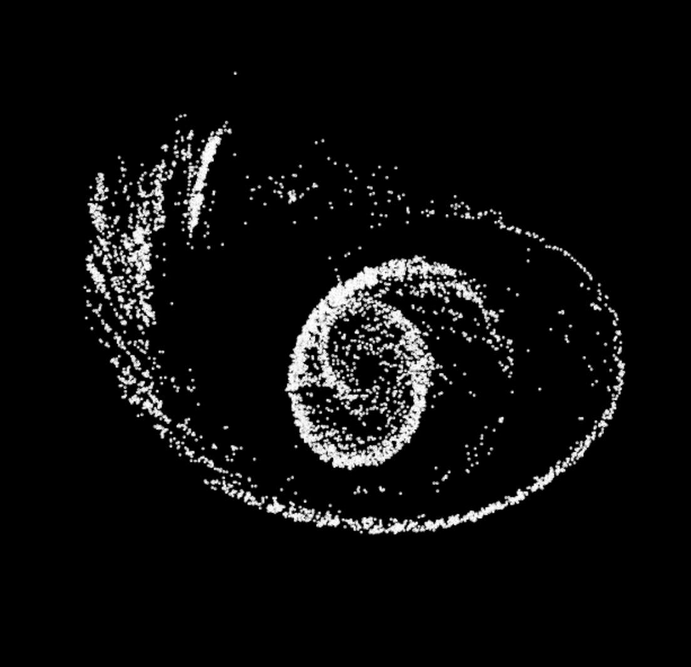

# Gravity.js

A Javascript 2d game physics engine, rendering in a Canvas on the browser. Inspired by the C++ game physics engine featured in the related Pikuma course. Learn more at [pikuma.com](https://pikuma.com/).

# Features

- Collision detection between different shape: Circles, Boxes, Polygons and Capsules
- Broad Phase using prune & sweep algorithm with AABB partitioning
- Warm starting with contact caching
- Distance joints
- Substepping to reduce collision tunneling
- Basic CCD for bullets with circle shape
- Texture rendering for shapes
- Set of demos showcasing different scenarios
- Generation of various forces: attraction, explosion, drag, friction

Example of simulation with 5.000 circle particles orbiting around a gravitational field:



# How to run

## Prerequisites

- Node.js installed

## Install dependencies

```
npm install
```

## Run

```
npm start
```

Now open the browser at http://localhost:1234

# References

- https://pikuma.com/courses/game-physics-engine-programming
- https://github.com/erincatto/box2d-lite
- https://github.com/Sopiro/Physics
