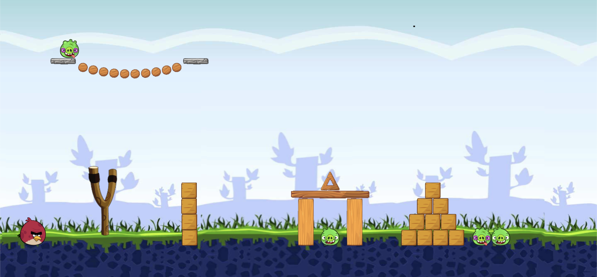

# Gravity.js

A 2D physics engine written in JavaScript and rendered in the browser using the HTML5 Canvas API.

The project is inspired by the C++ physics engine developed in the Pikuma Game Physics course, as well as engines such as Box2D-Lite and other open-source physics implementations referenced in the credits.

Learn more at [pikuma.com](https://pikuma.com/).

# Features

- Collision detection between different shape: Circles, Boxes, Polygons and Capsules
- Broad Phase using prune & sweep algorithm with AABB partitioning
- Warm starting with contact caching
- Distance joints
- Substepping to reduce collision tunneling
- Basic CCD for bullets with circle shape
- Texture rendering for shapes
- Set of demos showcasing different scenarios
- Generation of various forces: attraction, explosion, drag, friction

# How to run

## Prerequisites

- Node.js installed

## Install dependencies

```
npm install
```

## Run

```
npm start
```

Now open the browser at http://localhost:1234

# Example scenarios

The engine features a set of basic example scenarios with sprites based on the angry birds game.



In addition to the classic physics demos you can play around with some interesting simulations, for example these 5.000 circle particles orbiting around a gravitational field using the attraction force generation feature:


# References

- https://pikuma.com/courses/game-physics-engine-programming
- https://github.com/erincatto/box2d-lite
- https://github.com/Sopiro/Physics
