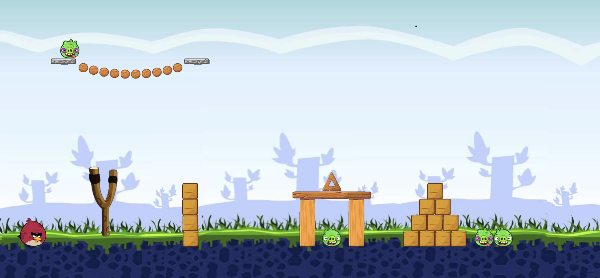
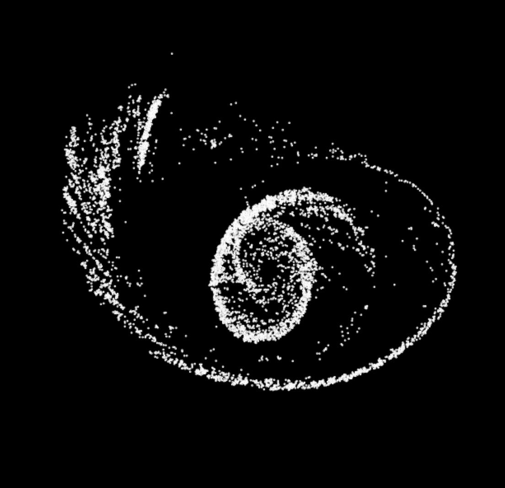

# Gravity.js

A 2D physics engine written in JavaScript and rendered in the browser using the HTML5 Canvas API.

The project is inspired by the C++ physics engine developed in the Pikuma Game Physics course, as well as engines such as Box2D-Lite and other open-source physics implementations referenced in the credits.

Learn more at [pikuma.com](https://pikuma.com/).

# Features

- Collision detection between different shapes: Circles, Boxes, Polygons, Segments and Capsules
- Broad Phase using prune & sweep algorithm with AABB partitioning
- Warm starting with contact caching
- Different types of joints
- Substepping to reduce collision tunneling
- Basic CCD for bullets with circle shape
- Texture rendering for shapes
- Set of demos showcasing different scenarios
- Generation of various forces: attraction, explosion, drag, friction, convection, buoyancy

# How to run

## Prerequisites

- Node.js installed

## Install dependencies

```
npm install
```

## Run the demo in development mode

```
npm start
```

This builds the Gravity.js package once, changes under `src` rebuild the package and refresh the demo automatically.

## Run the demo from the packaged version only

```
npm run start:package
```

This builds the package once and starts the Parcel development server without watching the engine source. Restart the command to include later changes under `src`.

For either command, open the URL printed by Parcel (usually http://localhost:1234).

# Example scenarios

The engine features a set of basic example scenarios with sprites based on the angry birds game.



In addition to the classic physics demos you can play around with some interesting simulations, for example these 5.000 circle particles orbiting around a gravitational field using the attraction force generation feature:



# App demo

A desktop live version of the app can be found at this [link](https://samdalvai.github.io/gravity.js/)

# References

- https://pikuma.com/courses/game-physics-engine-programming
- https://github.com/erincatto/box2d-lite
- https://github.com/erincatto/box2d
- https://github.com/Sopiro/Physics
- https://github.com/phaserjs/phaser-box2d
